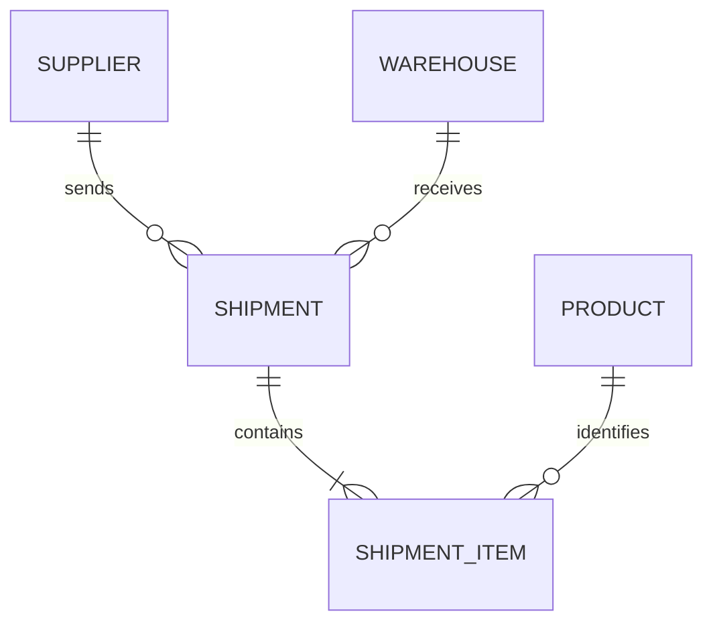

# Synthetic ETL Target Design

## 1. Purpose

CASE #01에서 관찰하고 진단할 공개 가능한 synthetic ETL target을 설계한다. 실제 회사 시스템, 업무 규칙 또는 데이터를 복제하지 않고 일반적인 파일 기반 ETL 처리 구조만 추상화한다.

이 문서는 STEP 2에서 구현할 baseline의 경계를 정한다. 성능 병목, 개선 방법 또는 결과를 미리 결정하지 않는다.

## 2. Research Question

> What dominates the processing time of this ETL system as data volume grows, and how can we identify the cause through evidence?

데이터 규모가 증가할 때 이 ETL 시스템의 처리시간을 지배하는 요소는 무엇이며, 그 원인을 증거를 통해 어떻게 찾아낼 수 있는가?

이 질문의 답은 현재 알려져 있지 않다. 이후 baseline 실행, 계측, 진단과 실험에서 수집한 evidence로 답한다.

## 3. Synthetic Problem Context

가상의 물류 운영자가 공급자로부터 창고에 도착한 배송 내역을 CSV 파일로 받는다. ETL 애플리케이션은 파일의 각 shipment item을 읽고 형식과 참조값을 검증하며, 수량과 단가로 금액을 계산한 뒤 Oracle에 import 결과를 저장한다.

이 상황은 완전히 synthetic이다. 명칭, 데이터와 규칙은 특정 회사나 실제 물류 시스템에서 가져오지 않는다.

## 4. Domain

선택한 domain은 **Synthetic Warehouse / Shipment Import**다.

선택 이유는 다음과 같다.

- 일반적인 배송과 창고 개념만으로 처음 보는 사람도 흐름을 이해할 수 있다.
- CSV 입력, 참조정보 조회, 계산과 저장이 억지 없이 연결된다.
- 특정 산업이나 회사 고유의 업무 지식이 필요하지 않다.
- 데이터량과 참조값 분포를 바꾸는 향후 synthetic dataset 실험이 가능하다.

주요 대안으로 주문 가져오기를 검토했다. 주문은 익숙하지만 가격 정책, 할인, 결제와 고객 정보로 범위가 쉽게 커진다. 단순 이벤트 가져오기는 더 작지만 reference lookup과 persistence 관계를 자연스럽게 설명하기 어려웠다. 배송 품목 가져오기가 필요한 구조를 가장 적은 업무 복잡성으로 표현한다.

## 5. Input

기본 입력 후보는 UTF-8 CSV 파일이다. 한 행은 하나의 shipment item을 나타낸다.

| Field | Meaning | Initial constraint |
| --- | --- | --- |
| `shipment_external_id` | 입력 파일 안에서 배송을 식별하는 synthetic ID | 비어 있지 않음 |
| `shipped_at` | 배송 시각 | 정해진 날짜·시간 형식 |
| `supplier_code` | 공급자 참조 코드 | 비어 있지 않음 |
| `warehouse_code` | 도착 창고 참조 코드 | 비어 있지 않음 |
| `product_code` | 상품 참조 코드 | 비어 있지 않음 |
| `quantity` | 배송 수량 | 양의 정수 |
| `unit_price` | 단가 | 0 이상의 소수 |

정확한 CSV 문법, 날짜 형식, 숫자 정밀도, 파일 크기와 값 분포는 STEP 2와 STEP 3에서 구현 필요에 맞춰 확정한다. 실제 dataset은 STEP 3에서 생성한다.

## 6. Processing Flow

```text
CSV Input
    ↓
Parse record
    ↓
Validate syntax and required values
    ↓
Look up Product, Supplier, and Warehouse references
    ↓
Apply minimal business rules and calculate line amount
    ↓
Persist Shipment and Shipment Item result
    ↓
Return import summary
```

baseline 후보는 한 record를 순서대로 처리하는 읽기 쉬운 흐름이다. lookup 횟수, transaction 경계와 persistence 호출 방식은 STEP 2에서 자연스러운 최소 구현을 선택하며, cache나 batch를 미리 넣지 않는다.

## 7. Domain Model



- **Product:** synthetic 상품 코드와 표시 이름을 가진 참조 entity
- **Supplier:** synthetic 공급자 코드와 표시 이름을 가진 참조 entity
- **Warehouse:** synthetic 창고 코드와 표시 이름을 가진 참조 entity
- **Shipment:** 외부 배송 ID, 배송 시각, supplier와 warehouse 관계, import 상태를 가진 header
- **Shipment Item:** shipment에 속하며 product, 수량, 단가와 계산 금액을 가진 line

표시 이름은 이해를 돕기 위한 synthetic 값이다. 성능 실험에 필요하지 않은 주소, 고객, 결제, 재고 같은 모델은 포함하지 않는다.

## 8. Persistence Model

향후 Oracle에 다음 논리 구조를 저장하는 것을 후보로 삼는다. STEP 1에서는 schema나 table을 생성하지 않는다.

| Logical table | Minimal data |
| --- | --- |
| `product` | internal ID, product code, display name, active flag |
| `supplier` | internal ID, supplier code, display name, active flag |
| `warehouse` | internal ID, warehouse code, display name, active flag |
| `shipment` | internal ID, external ID, shipped timestamp, supplier ID, warehouse ID, status |
| `shipment_item` | internal ID, shipment ID, product ID, quantity, unit price, line amount |

코드의 uniqueness, key 생성 방식, index, constraint, transaction 경계와 중복 입력 처리 방식은 구현 전에 결정할 사항이다. 성능 결과를 유도하기 위해 schema를 왜곡하지 않는다.

## 9. Minimal Business Rules

1. 필수 field가 존재하고 각 값이 지정된 형식으로 parse되어야 한다.
2. `quantity`는 양의 정수이고 `unit_price`는 0 이상이어야 한다.
3. supplier, warehouse와 product code는 존재하고 활성 상태여야 한다.
4. line amount는 `quantity × unit_price`로 계산한다.
5. 같은 shipment external ID를 가진 행은 하나의 shipment에 속한다.
6. 유효한 입력의 shipment와 item 관계가 persistence 결과에서도 유지되어야 한다.

반올림 규칙, 부분 성공 허용 여부와 중복 import 정책은 현재 확정하지 않는다. 구현과 신뢰성 실험에 실제로 필요한 시점에 명시한다.

## 10. Failure Conditions

향후 검증할 수 있는 일반적인 실패 후보는 다음과 같다.

- CSV column 누락, 잘못된 날짜 또는 숫자 형식
- 필수값 누락이나 허용 범위를 벗어난 수량·단가
- 존재하지 않거나 비활성인 reference code
- 같은 파일 안의 상충하는 shipment header 정보
- 이미 처리된 external ID의 재입력
- 처리 도중의 database 오류 또는 연결 중단
- 일부 item 저장 후 발생하는 실패

오류 처리 정책과 failure injection은 baseline 범위를 정할 때 최소한으로 다루고, transaction과 file-level atomicity 연구는 STEP 12에서 evidence가 요구하는 경우 수행한다.

## 11. Baseline Design Principles

- 동작을 쉽게 따라갈 수 있는 단순한 구조를 선택한다.
- 일반 개발자가 자연스럽게 작성할 법한 순차 처리로 시작한다.
- 불필요한 추상화와 사전 최적화를 넣지 않는다.
- 성능을 나쁘게 보이게 하려고 지연, CPU loop 또는 비현실적인 호출을 넣지 않는다.
- cache, batch와 병렬 처리는 측정 전 baseline에 포함하지 않는다.
- 정확성과 재현 가능성을 성능 수치보다 먼저 확인한다.

## 12. Explicit Unknowns

현재 사실과 미래 가설을 구분하기 위해 다음을 명시적으로 모르는 상태로 둔다.

- 어떤 처리 단계가 병목이 될지 모른다.
- reference lookup이 주요 병목인지 검증하지 않았다.
- persistence가 주요 병목인지 검증하지 않았다.
- CPU, parsing, memory와 database 중 무엇이 처리시간을 지배할지 모른다.
- cache가 성능을 개선할지 검증하지 않았다.
- batch processing이 성능을 개선할지 검증하지 않았다.
- 데이터 증가에 따라 어떤 component가 먼저 지배적이 될지 모른다.
- 입력값의 분포가 결과에 어떤 영향을 줄지 모른다.
- transaction 경계와 오류 정책이 성능과 정확성에 미칠 영향을 모른다.

## 13. Out of Scope

STEP 1에서는 다음을 수행하지 않는다.

- ETL application source code, parser, service, mapper, DAO 또는 domain class 구현
- Oracle schema, user, table, index 또는 seed data 생성
- dataset generator와 실제 CSV dataset 생성
- timer, counter, logger, APM 또는 진단 framework 구현
- baseline 실행, 성능 측정, 병목 가설 수립 또는 최적화
- cache, batch, concurrency와 transaction 실험
- 처리량이나 개선 배율 같은 성능 목표 설정

## 14. Decisions Deferred to Later Steps

- **STEP 2:** package와 component 구조, CSV 세부 형식, 오류 표현, transaction의 초기 경계, persistence 호출 방식
- **STEP 3:** dataset 크기, 값 분포, random seed와 재현 가능한 생성 규칙
- **STEP 4:** baseline 실행 조건과 최초 evidence 수집 방식
- **STEP 5 이후:** evidence가 요구하는 최소 계측과 drill-down 방법
- **STEP 9~11 후보:** cache와 batch 실험의 수행 여부 및 구체적 설계. STEP 4~8의 evidence가 지지할 때만 진행한다.
- **STEP 12 후보:** 실패 주입, rollback 범위와 file-level atomicity 검증 여부

이 결정 목록은 계획이지 각본이 아니다. evidence가 다른 원인을 가리키면 Roadmap과 실험 순서를 수정한다.
